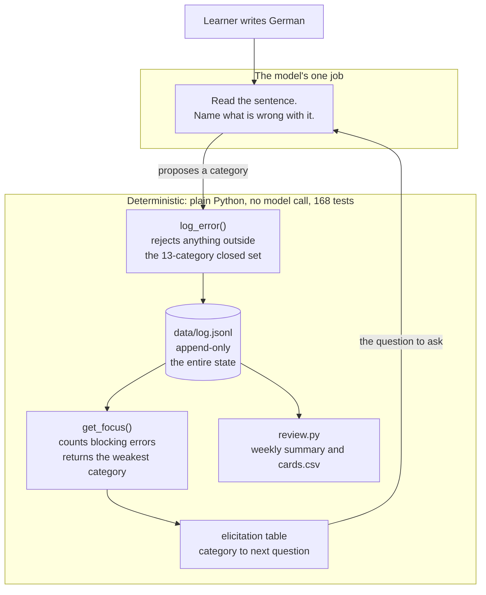

# german-b1-tutor

A Goethe-Zertifikat B1 *Schreiben* trainer: one ADK agent over an append-only
error log, with log-driven elicitation and a weekly review job.

[](https://github.com/ampaduchris/german-b1-tutor/actions/workflows/ci.yml)
[](pyproject.toml)
[](LICENSE)

**[Interactive architecture walkthrough →](https://ampaduchris.github.io/german-b1-tutor/)**

The question this project answers is where a language model should be *allowed*
to make a decision. Roughly two thirds of the behaviour here is deterministic:
counting, sorting, validation and every file write are plain Python, covered by
168 tests that pass on a fresh clone with no API key. The model is left the one
job that genuinely needs language understanding — reading a German sentence and
naming what is wrong with it — and even that writes into a closed thirteen-category
vocabulary it is not permitted to extend, because an open set silently
under-reports your worst weakness.

Built entirely through Claude Code from a written specification, with no
hand-written code. The artefacts worth reading are therefore `docs/spec-v3.md`
and `prompts/tutor.md` rather than the Python. The prompt is a contract of
eleven numbered obligations, and `scripts/regression.py` exists to measure
whether the model honours them on the wire — five planted errors, graded by set
comparison, against a pinned model.

## Where the model is allowed to decide



The model never chooses what to practise next. It proposes a label; Python
decides whether that label is admissible, counts the results, and looks up the
question that follows. Counting is arithmetic, not judgment, and a model asked
to count twenty entries can miscount and mis-aim an entire session without
raising an error.

## Does the prompt contract hold?

Claiming a prompt has eleven obligations is easy. `scripts/regression.py` plants
five errors with known categories and grades the model by set comparison, in a
sandbox, against a pinned model. The most recent run is committed as
[`docs/regression-2026-08-06.json`](docs/regression-2026-08-06.json):

| Measure | Result |
|---|---|
| Categories: expected vs observed | **5/5 exact** |
| Obligation 2 — `log_error` on every correction | honoured |
| Obligation 4 — `get_recent_errors()` at start | honoured |
| Obligation 8 — `get_focus()` before any output | honoured |
| Obligation 9 — follow-up on topic *(indicator, not proof)* | 5 consecutive, minimum 3 |
| Malformed log lines | 0 |
| Real log modified by the run | no — SHA-256 identical before and after |
| Model calls spent | 17 |

The baseline stores the SHA-256 of `tutor.md`, `agent.py` and `tools.py`
alongside the numbers, because a result is only comparable to another result if
the prompt that produced it was the same prompt. All three still match the files
in this commit.

**[Read the full transcript, verbatim →](docs/sample-session.md)**

## Using it

```bash
uv run agent.py                          # a study session: 1 = Aufgabe, 2 = Gespräch
uv run review.py                         # the weekly review. No model call.
uv run pytest                            # the deterministic layer. No model call.
uv run scripts/regression.py --runs 1    # the prompt regression check. ~12 model calls.
```

A session opens with a mode question, not a blank cursor. In **Gespräch** you
write one to three sentences at a time and are corrected every turn; `ENDE` or
an empty line ends it. In **Aufgabe** you get one task and then the agent goes
silent — type over as many lines as you like and send `FERTIG` to submit. It
will not comment on a partial draft, and that is enforced in code rather than by
asking the model nicely.

**Budget the free tier before you start.** `gemini-3.6-flash` allows **20
requests per day and 5 per minute** on a free key. One conversational turn costs
two model calls, so a full Gespräch is roughly a whole day's allowance and the
regression check is about twelve. A check and a session on the same day will not
both fit. If a session ends with `HTTP 429` that is the ceiling, not a bug —
every correction already logged is safely on disk.

## What is here

| File | Role |
|---|---|
| `agent.py` | The ADK agent. Two session shapes. The only runtime file that calls a model. |
| `tools.py` | Five deterministic functions over the log. Zero model calls, ever. |
| `review.py` | Weekly aggregation and the Anki export. Zero model calls, ever. |
| `prompts/tutor.md` | The system prompt: eleven standing obligations, the elicitation table, the closed vocabularies. Edit this to change behaviour; no code change is needed. |
| `data/log.jsonl` | Append-only JSON Lines. **The entire persistent state of the system.** |
| `data/cards.csv` | Anki import, regenerated by `review.py`. |
| `scripts/regression.py` | The fixed check from spec section 11. Five planted errors, graded by set comparison. Never writes to the real log. |
| `scripts/smoke_test.py` | One model call, no tools, no prompt. Answers only "is the key working?" |
| `tests/` | 168 unit tests over everything that does not need a model. No API key required; they pass on a fresh clone. |
| `.github/workflows/ci.yml` | Runs those tests on Python 3.10 through 3.13, with no key and no secret configured. That is the point: a deterministic layer that needed a key would not be one. |

Documentation:

| File | Role |
|---|---|
| `docs/spec-v3.md` | The technical implementation spec. Authoritative. |
| `docs/BUILD-LOG.md` | Append-only cross-session record. **Read this before changing anything** — it holds every ambiguous decision, every unverified check, and the acceptance audit. |
| `docs/tutorial.md` | The agent-architecture concepts the build teaches. |
| `docs/build-sessions.md` | The five build prompts, one per session. |
| `docs/sample-session.md` | A real run, verbatim: five planted errors, the agent's replies, and the log lines they produced. |
| `docs/regression-2026-08-06.json` | The committed regression baseline the table above is read from. |
| `docs/explainer.html` | Interactive walkthrough of the architecture. [Live version](https://ampaduchris.github.io/german-b1-tutor/), or open the file in a browser. |

## Setup

- Python 3.10 or later. `uv` manages it; the venv here is 3.13.5.
- A Google AI Studio key in `.env` as `GOOGLE_API_KEY=…`. Free tier is enough.
- `uv sync` builds the environment. There is no `pip` in the venv and no
  `requirements.txt`; add dependencies with `uv add`.

Copy `.env.example` to `.env` and paste your key in. `.env` and `data/` are
gitignored and no key is needed to run the tests.

Keeping the key in the macOS Keychain rather than in shell history is worth the
one-time setup: store it with `security add-generic-password -s gemini-api-key
-a "$USER" -w`, then rebuild `.env` by piping
`security find-generic-password -s gemini-api-key -a "$USER" -w` into it. Never
echo it.

## Editing the prompt

`prompts/tutor.md` is a contract, not a personality. Change one obligation at a
time, and measure it rather than guessing:

```bash
cp "data/regression-$(date +%F).json" /tmp/before.json   # if one exists
# edit prompts/tutor.md, one obligation
uv run scripts/regression.py --runs 1
diff /tmp/before.json "data/regression-$(date +%F).json"
```

The harness checks the categories that reach the log *and* whether obligations
2, 4 and 8 were honoured on the wire. Obligation 9 is an indicator only:
deciding it exactly would need a model, and a model grader would share the blind
spots of the model under test.

## How it was built, and who decided what

"No hand-written code" is a claim about typing, and typing is not the
interesting part. Every decision that shaped this system was argued in writing
before any code existed, and the record is
[`docs/BUILD-LOG.md`](docs/BUILD-LOG.md) — 1,247 lines, append-only, one entry
per build session, written to be read by whoever changes this next.

It is the honest artefact because it records what went wrong alongside what went
right:

- **A vocabulary left open too long.** `mode` and `task_type` were not closed in
  code until session 5. In the interim four spellings for two modes existed
  across these documents — precisely the drift the closed category set exists to
  prevent, one field over. Session 2 declined to invent a set the spec had not
  defined; session 3 could only enforce one in prose; session 5 closed it in
  code. The delay is documented as a cost, not excused.
- **What is still unproven.** The acceptance audit closes at **five PASS, two
  NOT VERIFIED, one NOT APPLICABLE, zero FAIL** — and the two unverified ones are
  named. `review.py` has never run against real study data, and `cards.csv` has
  never been imported into Anki, because there is no Anki on the build machine.
- **A failure mode left unhandled on purpose.** Of seven audited, one — "you stop
  opening it" — is neither prevented nor detected. It is a recorded deferral
  whose trigger symptom is the thing itself, not an oversight.

The specification is [`docs/spec-v3.md`](docs/spec-v3.md); every claim in it
carries a confidence marker (**H**, **M**, **L**) so that assumptions can be
told apart from verified facts. The five prompts that drove the build are in
[`docs/build-sessions.md`](docs/build-sessions.md), so the process is
reproducible rather than merely described.

## The rule that matters

Nothing gets built ahead of the symptom that demands it. Spec section 10 lists
the deferred extensions and the trigger for each. If a change proposes one, the
correct response is to record it in the build log and not build it.
